# How To Setup XAMPP to run PHP projects

<h2>Step 1:</h2>

[Download and install XAMPP](https://www.apachefriends.org/download.html)
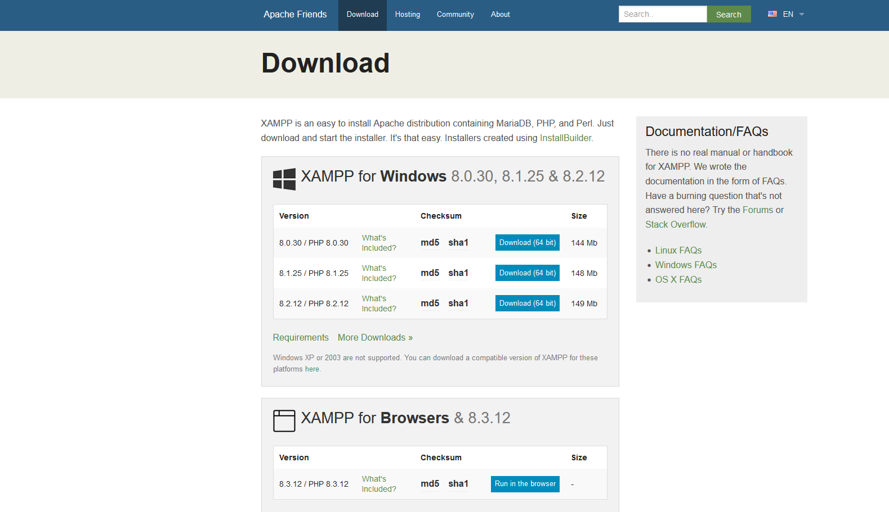

<h2>Step 2:</h2>

Download the desired project files from this repository.

<h2>Step 3:</h2>

Open file explorer and navigate to your XAMPP directory. 
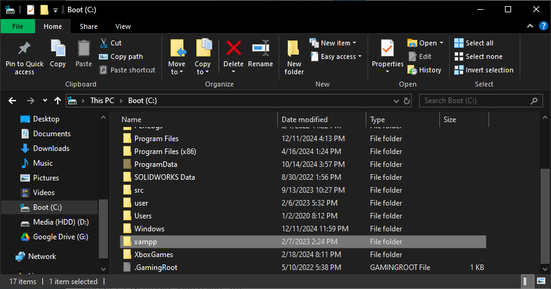

<h2>Step 4:</h2>
Open the htdocs folder.

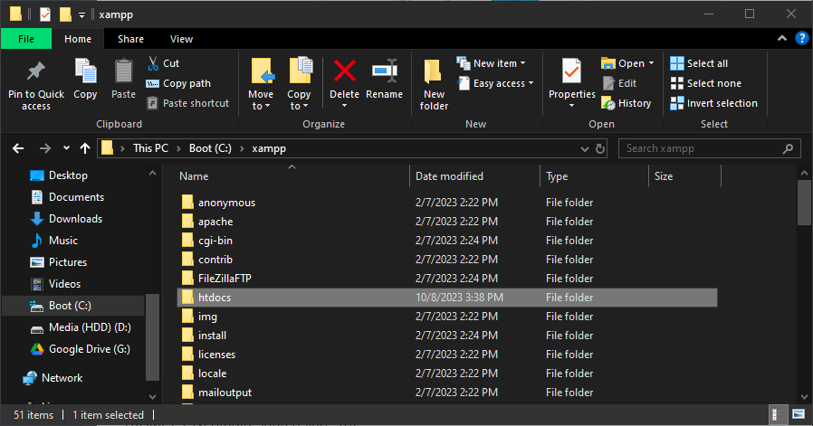

<h2>Step 5:</h2>
Create a new folder with any name of choice inside of htdocs

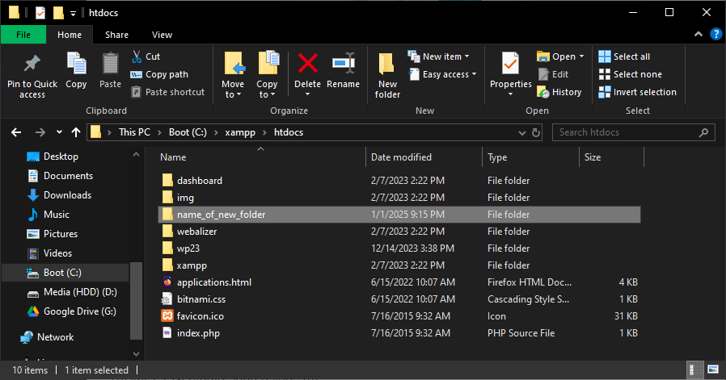

<h2>Step 6:</h2>
Move downloaded files into this new directory. This example is for the 

[Login Picture Website](LoginPictureWebsite)
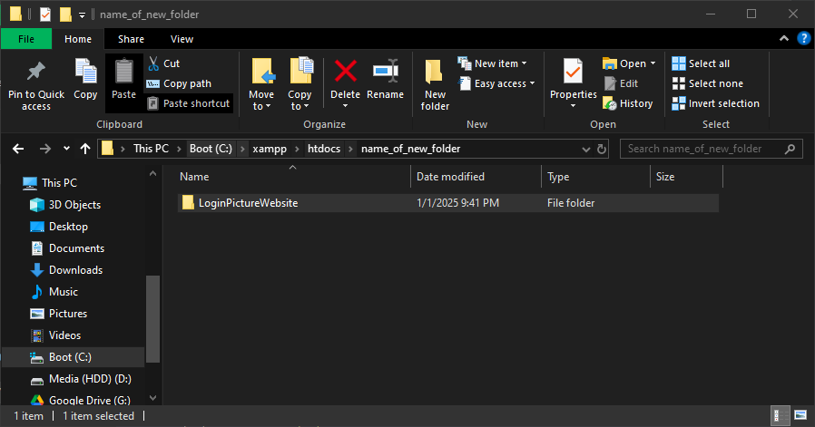

<h2>Step 7:</h2>
Click Start on Apache and MySQL and then click the shell button on the control panel.

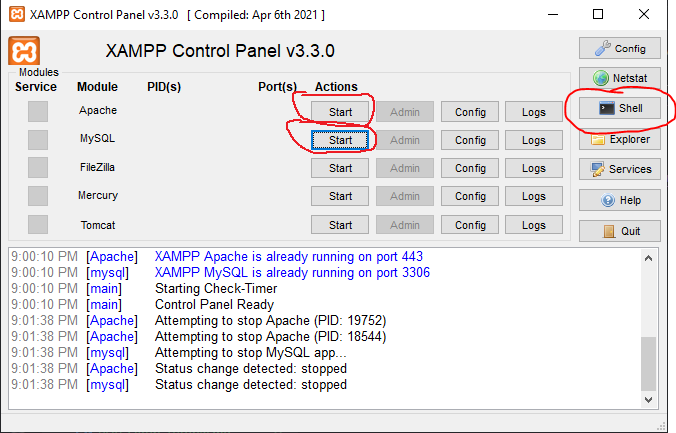

<h2>Step 8:</h2>

Enter "mysql -u root -p" into the terminal then enter a blank password
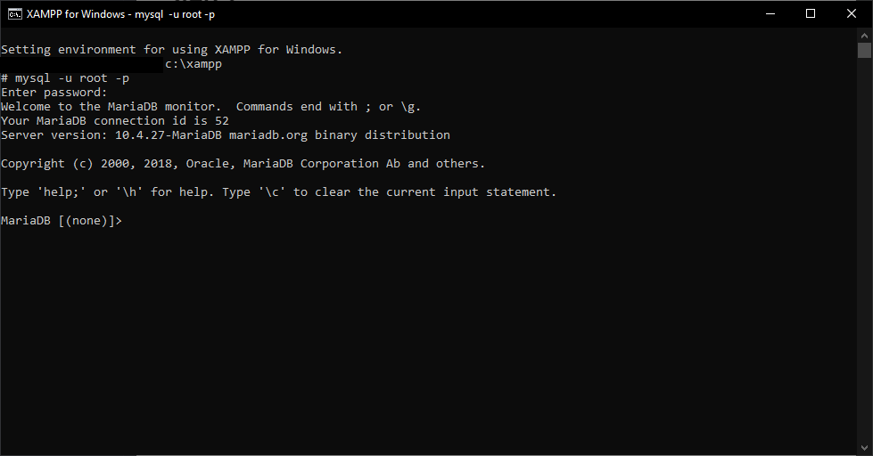

<h2>Step 9:</h2>
Open the PHP project folder from Step 6 in file explorer and find "database.sql". 

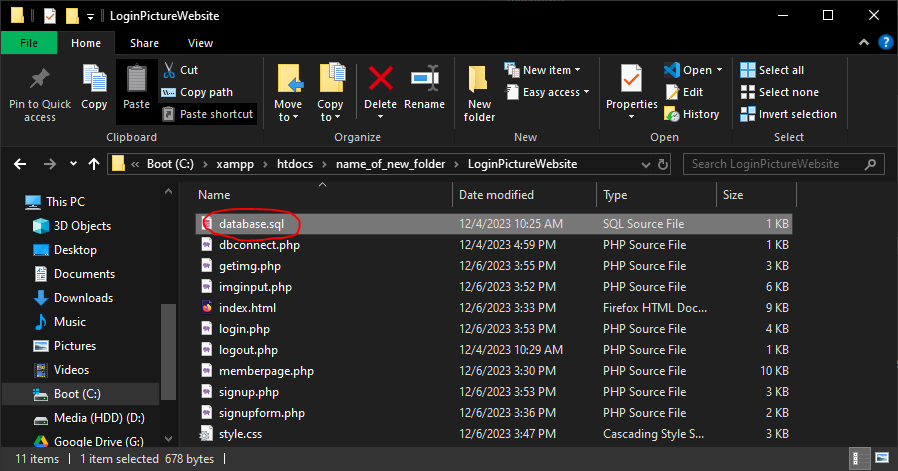

<h2>Step 10:</h2>

Open the file and use CTRL+A to copy the code
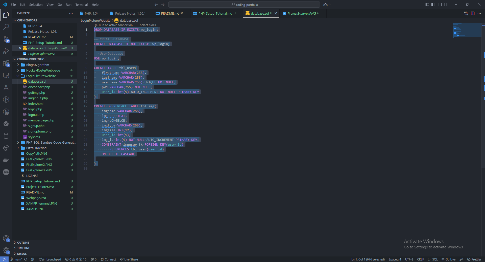

<h2>Step 11:</h2>
Go back to the terminal from step 8 and paste the SQL code.

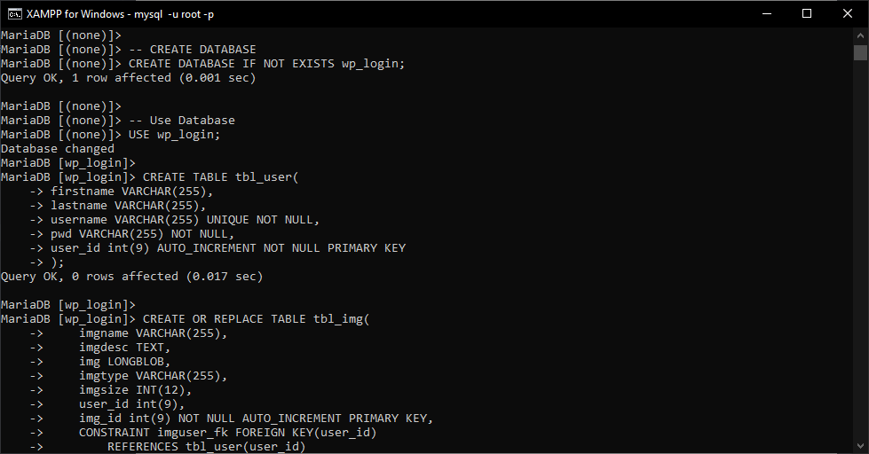

<h2>Step 12:</h2>
Navigate to "localhost/name_of_new_folder/" on your browser of choice. Replace name_of_new_folder with folder name. You should see a page similar to below.

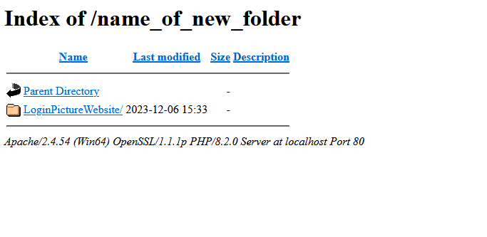

Congratulations! You have setup XAMPP to run my projects! The same steps can be used to add more projects. Make sure to run Apache and MySQL when using my projects for them to work. 

Visit http://localhost/phpmyadmin/ on your browser to view more information about the databases.